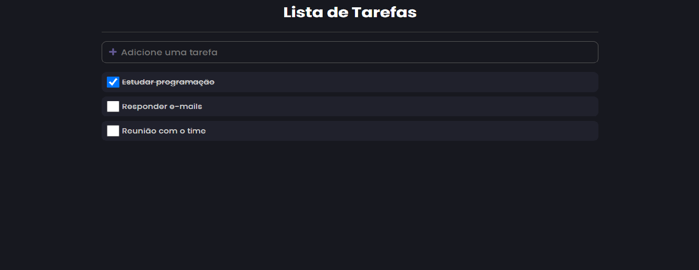

<h1 align="center">
    
</h1>

<br>

## 🛠 Tecnologias
Foi desenvolvido com:

- [React](https://reactjs.org)
- [Styled-Components](https://styled-components.com/)
- [TypeScript](https://www.typescriptlang.org/)

## 💻 Projeto
Projeto de uma lista de tarefas, onde o usuário pode ver suas tarefas, marcar as que já terminou e adicionar outras. Desenvolvi com o intuito de aprender mais sobre TypeScript.

## 🚀 Bora executar?
Clone o projeto e acesse a pasta do mesmo.

### No Git Bash dê o comando:
$ git clone https://github.com/carlosdaniel31/todo-app<br>

### Para iniciá-lo, siga os passos abaixo:
Em seu editor na pasta do projeto dê os comandos:<br>
```npm install```<br>
```npm run start```
